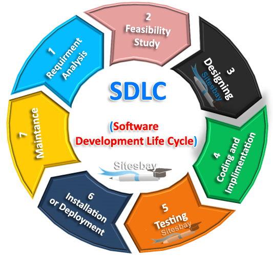
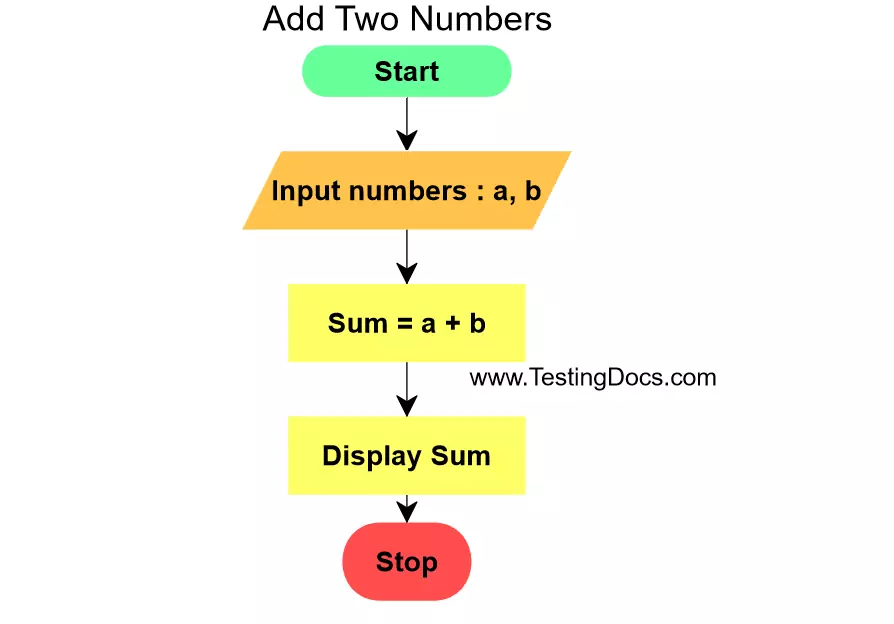

# what is software?
- software is a general name given to all programs that cann run on computer hardware such as spreadsheet.
https://www.google.com/url?sa=i&url=https%3A%2F%2Fwww.techstation.in%2Fwhat-is-software%2F&psig=AOvVaw1wXL9zYuEByjrmBX7uFda7&ust=1672405298789000&source=images&cd=vfe&ved=0CBAQjRxqFwoTCMCCma7xnvwCFQAAAAAdAAAAABAE
## There are two types of software:-
 ```
 1. operating system.
 - An operating system is a collection of system programs that manage the resources of a computer and control the running of user programs. 
 ```
 ```
 2. application software.
 - Application software utilizes the capacities of a computer directly to a dedicated task.Application software is able to maniputate text,numbers and graphics.

 ```

 # what is software engineering?
 - software engineering is an engineering discipline that is concerned with all aspects of software production.
 - software engineers should adoupt a systematic and organised approach to their work and use appropriate tools and techniques depending on the problem to be solved, the development constraints and the rescources available.https://www.google.com/url?sa=i&url=https%3A%2F%2Fwww.computerhope.com%2Fjargon%2Fs%2Fsoftengi.htm&psig=AOvVaw1H3IzsS5b1cd8FYli7Gvb1&ust=1672406622720000&source=images&cd=vfe&ved=0CBAQjRxqFwoTCMDjuqX2nvwCFQAAAAAdAAAAABAE

 # what is SDLC? explain each phase of SDLC?
 - The SDLC (Software Development Life Cycle) is a structured process that enables the production of high-quality,low-cost software,in the shortest possible production time.
 

 ```
 1. PLANNING:-
 - The purpose of this first phase is to find out the scope of the problem and determine solutions. Recources,costs,time,benefitss and other iteams sholud be considered here.
 ```
 ```
 2. SYSTEM ANALYSIS & REQUIREMENTS:-
 - The sec phase is where teams consider the functional requirements of the project or solution. It's also where system analysis takes place or analyzing the needs of the end users to ensure the new system can meet their expectations.
```
```
3. SYSTEM DESIGN:- 
- The neccessary specifications,features and opertions that will satisfy the functional requirements of the proposed system which will be in place.
```
```
4. DEVELOPMENT:-
- Now the work begins!The development phase marks the end of the initial section of the process. Additionally,this phase signifies the start of production. The development stage is also charaterized by instillation & change.
```
```
5. INTERGATION & TESTING:-
- This phase invloves the system intergration & system testing(programs & procedures) normaly carried out by a Quality Assurance professtional to determine if teh proposed design meets the initial set of business goals.
```
```
6. IMPLEMENTATION:-
- The sixth phase is when the majority of the programs is written, and when the project is put into production by moving the data and components from the odd system and placing them in the new system via a direct cutover.
```
```
7. OPERATIONS & MAINTAINANCE:-
- The last phase is when end users can fine-tune the system,if they wish,to boost performance,add new capabilities or meet additional user requirements.
```
https://www.google.com/url?sa=i&url=https%3A%2F%2Fwww.tpgi.com%2Faccessible-sdlc%2F&psig=AOvVaw3BUK3cPFHqPoBPYQYicjY9&ust=1672406105856000&source=images&cd=vfe&ved=0CBAQjRxqFwoTCMj5iq_0nvwCFQAAAAAdAAAAABAE


# What is DFD? create a DFD diagram on filpkart?
- Data flow diagrams are also used to model information systems. They provide greater details than a context diagram as they display each process invloved within the information system as an individual circle, meaning the end result will contain multiple processes.A DFD also has a shape for data stores to represent where data is sent and retrieved from, such as a specfic database. Data stores are represented as a four sided rectangle shape.
https://www.google.com/url?sa=i&url=https%3A%2F%2Fwww.visual-paradigm.com%2Fguide%2Fdata-flow-diagram%2Fwhat-is-data-flow-diagram%2F&psig=AOvVaw2rJrpyoWHeyQcw71QIh_4P&ust=1672406161248000&source=images&cd=vfe&ved=0CBAQjRxqFwoTCOizscn0nvwCFQAAAAAdAAAAABAE

# what is flowchart?Create a flowchart of addtion of two numbers?
- A diagram that is used to illustrate the logical or chronological sequence of tasks in a job or process. May also be called as "flowsheet"
 beref


 
 # What is Use Case Diagram? create a use case on bill payment on paytm? 
 - Use case defines the required features of the system. without these features the system cannot be used succesfully.
 - Each use case is named using "verb phase" that shows a goal the system must accomplish, ex."deposit money","withdraw money" e.t.c.
 ## Elements of a use case Diagram
 https://www.google.com/url?sa=i&url=https%3A%2F%2Ft2informatik.de%2Fen%2Fsmartpedia%2Fuse-case-diagram%2F&psig=AOvVaw21Cjr4Jimk7CqjmqkGTdbD&ust=1672406422229000&source=images&cd=vfe&ved=0CBAQjRxqFwoTCJCf_MX1nvwCFQAAAAAdAAAAABAE


